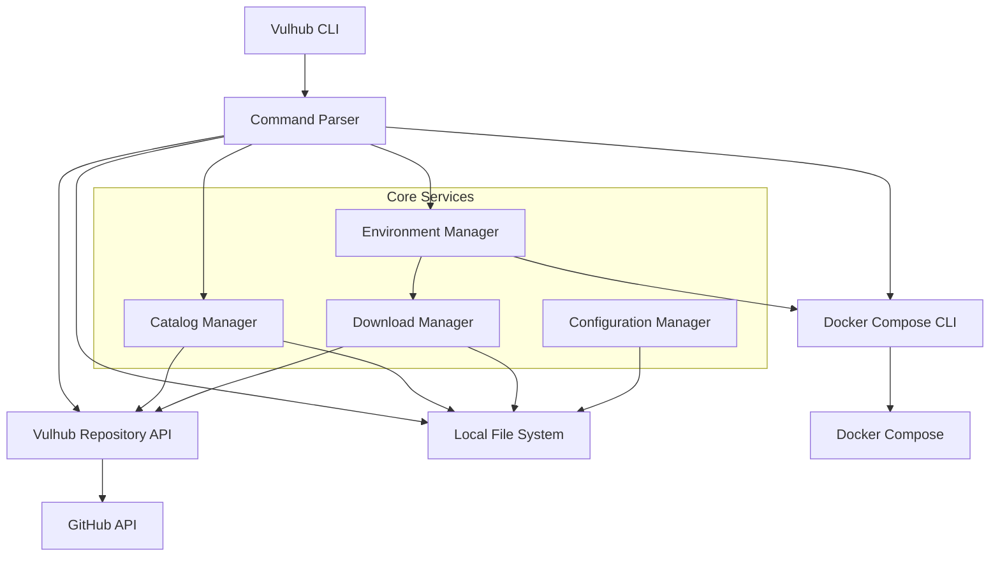

# Design Document

## Overview

The Vulhub CLI tool is a command-line interface that simplifies the interaction with the Vulhub security lab platform. It abstracts away Docker Compose complexity and provides a streamlined experience for security researchers to deploy, manage, and interact with vulnerability environments.

The tool will be built as a standalone CLI application using Go that interfaces with the Vulhub GitHub repository, Docker daemon, and local file system to provide seamless vulnerability environment management. Go was chosen for its excellent CLI tooling ecosystem, cross-platform compilation, and strong concurrency support for handling multiple Docker operations.

## Architecture

### Go Project Structure

The project follows standard Go project layout conventions:

```
vulhub-cli/
├── cmd/
│   └── vulhub/           # Main application entry point
│       └── main.go
├── internal/             # Private application code
│   ├── cli/             # CLI command implementations
│   ├── compose/         # Docker Compose integration
│   ├── config/          # Configuration management
│   ├── download/        # Download management
│   ├── environment/     # Environment lifecycle management
│   └── vulhub/          # Vulhub API integration
├── pkg/                 # Public library code (if any)
├── test/                # Test utilities and fixtures
├── scripts/             # Build and deployment scripts
├── docs/                # Documentation
├── go.mod               # Go module definition
├── go.sum               # Go module checksums
├── Makefile             # Build automation
└── README.md
```

### Key Dependencies

- **CLI Framework**: `github.com/urfave/cli` for command-line interface
- **Dependency Injection**: `github.com/uber-go/fx` for dependency management
- **TOML Parsing**: `github.com/BurntSushi/toml` for environments.toml parsing
- **HTTP Client**: `github.com/go-resty/resty` for enhanced HTTP operations
- **GitHub Client**: `github.com/google/go-github` for GitHub API integration
- **Utility Functions**: `github.com/samber/lo` for functional programming helpers
- **File Operations**: Standard `os`, `path/filepath` packages
- **Concurrency**: Standard `context`, `sync` packages
- **Testing**: Standard `testing` package with `github.com/stretchr/testify` for assertions
- **Logging**: `log/slog` for structured logging
- **Progress Bars**: `github.com/schollz/progressbar/v3` for download progress

### High-Level Architecture



### Component Architecture

The application follows a modular architecture with clear separation of concerns using dependency injection:

1. **CLI Layer**: Command parsing and user interaction using urfave/cli
2. **Service Layer**: Business logic and orchestration with fx dependency injection
3. **API Layer**: External integrations (Docker, GitHub) using go-github and resty
4. **Storage Layer**: Local caching and configuration management
5. **Utility Layer**: Helper functions using samber/lo for functional operations

### Dependency Injection Architecture

The application uses Uber's fx framework for dependency injection, providing:

- **Lifecycle Management**: Automatic startup and shutdown of components
- **Interface-based Design**: Clean separation between interfaces and implementations
- **Configuration Management**: Centralized configuration injection
- **Testing Support**: Easy mocking and testing of components

```go
// Example fx module structure
var Module = fx.Options(
    fx.Provide(
        NewVulhubAPI,
        NewEnvironmentManager,
        NewDownloadManager,
        NewConfigManager,
    ),
    fx.Invoke(RegisterCLICommands),
)
```

## Components and Interfaces

### 1. Command Line Interface (CLI)

**Purpose**: Parse user commands and coordinate with appropriate services

**Key Classes**:
- `VulhubCLI`: Main entry point and command dispatcher
- `CommandParser`: Parse and validate user input
- `OutputFormatter`: Format and display results to user
- `InteractiveSelector`: Handle interactive environment selection

**Supported Commands**:
- `vulhub start <path>`: Start environment by path
- `vulhub search <keyword>`: Search environments and interactively select
- `vulhub list`: List running environments
- `vulhub list-available`: List all available environments
- `vulhub stop <path>`: Stop specific environment
- `vulhub info <path>`: Show environment details
- `vulhub clean [path]`: Clean up environments
- `vulhub update`: Manually update environments catalog
- `vulhub status <path>`: Show environment status

**Interface**:
```go
type CLICommand interface {
    Name() string
    Description() string
    Execute(args []string) (*CLIResult, error)
    Validate(args []string) error
}

type CLIResult struct {
    Success bool        `json:"success"`
    Message string      `json:"message"`
    Data    interface{} `json:"data,omitempty"`
}
```

### 2. Environment Manager

**Purpose**: Manage vulnerability environment lifecycle

**Key Classes**:
- `EnvironmentManager`: Core environment operations
- `EnvironmentStatus`: Track environment states
- `PortManager`: Handle port allocation and conflicts

**Interface**:
```go
type EnvironmentManager interface {
    Start(ctx context.Context, path string) (*EnvironmentResult, error)
    Stop(ctx context.Context, path string) (*EnvironmentResult, error)
    Restart(ctx context.Context, path string) (*EnvironmentResult, error)
    GetStatus(ctx context.Context, path string) (*EnvironmentStatus, error)
    ListRunning(ctx context.Context) ([]*EnvironmentInfo, error)
    GetLogs(ctx context.Context, path string) (string, error)
}

type EnvironmentInfo struct {
    Path      string         `json:"path"`
    Name      string         `json:"name"`
    Status    string         `json:"status"` // "running", "stopped", "error"
    Ports     []PortMapping  `json:"ports"`
    StartTime *time.Time     `json:"start_time,omitempty"`
}

type EnvironmentResult struct {
    Success   bool           `json:"success"`
    Message   string         `json:"message"`
    Ports     []PortMapping  `json:"ports,omitempty"`
    AccessURL string         `json:"access_url,omitempty"`
}

type EnvironmentStatus struct {
    Running    bool      `json:"running"`
    Containers []string  `json:"containers"`
    Health     string    `json:"health"`
    Uptime     string    `json:"uptime,omitempty"`
}
```

### 3. Vulhub Repository API

**Purpose**: Interface with Vulhub GitHub repository for environment discovery and download

**Key Classes**:
- `VulhubAPI`: GitHub API client using go-github
- `EnvironmentCatalog`: Cache and search available environments
- `TOMLParser`: Parse environments.toml configuration file
- `SearchEngine`: Advanced search functionality using samber/lo utilities

**Interface**:
```go
type VulhubAPI interface {
    LoadEnvironmentsCatalog(ctx context.Context, forceUpdate bool) (*EnvironmentCatalog, error)
    SearchEnvironments(ctx context.Context, keyword string) ([]*EnvironmentMetadata, error)
    GetEnvironmentInfo(ctx context.Context, path string) (*EnvironmentMetadata, error)
    DownloadEnvironment(ctx context.Context, path string) (string, error)
    ListAvailableEnvironments(ctx context.Context) ([]*EnvironmentMetadata, error)
    UpdateCatalog(ctx context.Context) error
    CheckForUpdates(ctx context.Context) (bool, error)
}

const (
    VulhubRepository      = "https://github.com/vulhub/vulhub"
    EnvironmentsTOMLURL   = "https://raw.githubusercontent.com/vulhub/vulhub/master/environments.toml"
)

type EnvironmentMetadata struct {
    Name        string     `toml:"name" json:"name"`
    CVE         []string   `toml:"cve" json:"cve"`
    App         string     `toml:"app" json:"app"`
    Path        string     `toml:"path" json:"path"`
    Tags        []string   `toml:"tags" json:"tags"`
    DownloadURL string     `json:"download_url,omitempty"`
    LastUpdated *time.Time `json:"last_updated,omitempty"`
}

type EnvironmentCatalog struct {
    Environments []*EnvironmentMetadata `json:"environments"`
    LastUpdated  time.Time              `json:"last_updated"`
    Version      string                 `json:"version,omitempty"`
    Source       string                 `json:"source"` // GitHub repository URL
}

type SearchEngine interface {
    SearchByKeyword(ctx context.Context, keyword string) ([]*EnvironmentMetadata, error)
    SearchByApp(ctx context.Context, appName string) ([]*EnvironmentMetadata, error)
    SearchByCVE(ctx context.Context, cve string) ([]*EnvironmentMetadata, error)
    SearchByTag(ctx context.Context, tag string) ([]*EnvironmentMetadata, error)
    InteractiveSelect(results []*EnvironmentMetadata) (*EnvironmentMetadata, error)
}

type TOMLParser interface {
    ParseEnvironmentsFile(content string) ([]*EnvironmentMetadata, error)
    ValidateTOMLStructure(content string) error
}

type CatalogManager interface {
    InitializeCatalog(ctx context.Context) (*EnvironmentCatalog, error)
    UpdateCatalog(ctx context.Context, force bool) error
    GetCatalog(ctx context.Context) (*EnvironmentCatalog, error)
    IsUpdateNeeded(ctx context.Context) (bool, error)
    GetLastUpdateTime() (*time.Time, error)
}

type UpdateScheduler interface {
    SchedulePeriodicUpdates(ctx context.Context, interval time.Duration)
    CheckAndUpdate(ctx context.Context) error
    Stop()
}
```

### 4. Docker Compose Integration

**Purpose**: Execute Docker Compose commands for container management while maintaining compatibility

**Key Classes**:
- `ComposeExecutor`: Execute Docker Compose CLI commands
- `ComposeManager`: Manage Docker Compose operations
- `SystemChecker`: Verify Docker and Docker Compose availability

**Interface**:
```go
type ComposeExecutor interface {
    IsDockerAvailable(ctx context.Context) (bool, error)
    IsComposeAvailable(ctx context.Context) (bool, error)
    ExecuteCompose(ctx context.Context, action *ComposeAction, workingDir string) (*ComposeResult, error)
    GetProjectStatus(ctx context.Context, projectName string) (*ProjectStatus, error)
    CleanupProject(ctx context.Context, projectName string) (*CleanupResult, error)
}

type ComposeAction struct {
    Command  string            `json:"command"` // "up", "down", "restart", "ps", "logs"
    Options  map[string]string `json:"options"`
    Detached bool              `json:"detached"`
}

type ComposeResult struct {
    Success    bool     `json:"success"`
    Output     string   `json:"output"`
    Error      string   `json:"error,omitempty"`
    ExitCode   int      `json:"exit_code"`
    Containers []string `json:"containers,omitempty"`
}

type ProjectStatus struct {
    Name       string              `json:"name"`
    Status     string              `json:"status"`
    Containers []*ContainerStatus  `json:"containers"`
}

type ContainerStatus struct {
    Name    string `json:"name"`
    Status  string `json:"status"`
    Ports   string `json:"ports"`
    Image   string `json:"image"`
}
```

### 5. Download Manager

**Purpose**: Handle downloading and caching of vulnerability environments

**Key Classes**:
- `DownloadManager`: Coordinate downloads and local file management
- `CatalogManager`: Handle environments.toml updates and local storage
- `FileValidator`: Validate downloaded files
- `UpdateScheduler`: Handle automatic catalog updates

**Interface**:
```go
type DownloadManager interface {
    DownloadEnvironment(ctx context.Context, path string) (*DownloadResult, error)
    GetCachedEnvironment(path string) (string, error)
    ValidateEnvironment(localPath string) (*ValidationResult, error)
    CleanupCache(ctx context.Context, path string) (*CleanupResult, error)
    DownloadEnvironmentsCatalog(ctx context.Context, forceUpdate bool) (string, error)
    GetCachedCatalog() (string, error)
    IsCatalogStale() (bool, error)
}

type DownloadResult struct {
    Success   bool   `json:"success"`
    LocalPath string `json:"local_path"`
    Size      int64  `json:"size"`
    Message   string `json:"message"`
}

type ValidationResult struct {
    Valid         bool     `json:"valid"`
    Issues        []string `json:"issues,omitempty"`
    ComposeFile   string   `json:"compose_file"`
    HasDockerfile bool     `json:"has_dockerfile"`
}

type CleanupResult struct {
    Success      bool     `json:"success"`
    FilesRemoved []string `json:"files_removed"`
    SpaceFreed   int64    `json:"space_freed"`
    Message      string   `json:"message"`
}
```

### 6. Configuration Manager

**Purpose**: Manage application configuration and user preferences

**Key Classes**:
- `ConfigManager`: Application configuration
- `UserPreferences`: User-specific settings
- `SystemChecker`: Validate system requirements

**Interface**:
```go
type ConfigManager interface {
    GetConfig() (*AppConfig, error)
    UpdateConfig(config *AppConfig) error
    ValidateSystemRequirements(ctx context.Context) (*SystemStatus, error)
    LoadDefaults() *AppConfig
}

type AppConfig struct {
    StorageDirectory      string        `yaml:"storage_directory" json:"storage_directory"`
    DefaultPortRange      *PortRange    `yaml:"default_port_range" json:"default_port_range"`
    AutoCleanup          bool          `yaml:"auto_cleanup" json:"auto_cleanup"`
    VerboseLogging       bool          `yaml:"verbose_logging" json:"verbose_logging"`
    CatalogUpdateInterval time.Duration `yaml:"catalog_update_interval" json:"catalog_update_interval"`
    AutoUpdateCatalog    bool          `yaml:"auto_update_catalog" json:"auto_update_catalog"`
    VulhubRepository     string        `yaml:"vulhub_repository" json:"vulhub_repository"`
}

type PortRange struct {
    Start int `yaml:"start" json:"start"`
    End   int `yaml:"end" json:"end"`
}
```

## Data Models

### Environment Models

```go
type VulnerabilityEnvironment struct {
    Path              string               `json:"path"`
    Metadata          *EnvironmentMetadata `json:"metadata"`
    LocalPath         string               `json:"local_path,omitempty"`
    DockerComposePath string               `json:"docker_compose_path"`
    Status            *EnvironmentStatus   `json:"status"`
    Containers        []*ContainerInfo     `json:"containers"`
}

type ContainerInfo struct {
    Name        string         `json:"name"`
    Image       string         `json:"image"`
    Ports       []PortMapping  `json:"ports"`
    Status      string         `json:"status"` // "running", "stopped", "error"
    HealthCheck *HealthStatus  `json:"health_check,omitempty"`
}

type PortMapping struct {
    HostPort      int    `json:"host_port"`
    ContainerPort int    `json:"container_port"`
    Protocol      string `json:"protocol"` // "tcp", "udp"
    Service       string `json:"service"`
}

type HealthStatus struct {
    Status      string    `json:"status"`
    LastChecked time.Time `json:"last_checked"`
    Retries     int       `json:"retries"`
}
```

### Configuration Models

```go
type SystemStatus struct {
    DockerInstalled         bool                `json:"docker_installed"`
    DockerRunning          bool                `json:"docker_running"`
    DockerComposeAvailable bool                `json:"docker_compose_available"`
    AvailableDiskSpace     int64               `json:"available_disk_space"`
    NetworkConnectivity    bool                `json:"network_connectivity"`
    RequiredPorts          []*PortAvailability `json:"required_ports"`
}

type PortAvailability struct {
    Port               int    `json:"port"`
    Available          bool   `json:"available"`
    ConflictingService string `json:"conflicting_service,omitempty"`
}
```

## Error Handling

### Error Categories

1. **System Errors**: Docker Compose not available, insufficient permissions
2. **Network Errors**: GitHub API failures, download interruptions
3. **Validation Errors**: Invalid environment path format, missing docker-compose.yml files, malformed environments.toml
4. **Resource Errors**: Port conflicts, insufficient disk space

### Error Handling Strategy

```go
type VulhubError struct {
    Code        ErrorCode     `json:"code"`
    Category    ErrorCategory `json:"category"`
    Message     string        `json:"message"`
    Suggestions []string      `json:"suggestions"`
    Recoverable bool          `json:"recoverable"`
    Cause       error         `json:"-"`
}

func (e *VulhubError) Error() string {
    return e.Message
}

func (e *VulhubError) Unwrap() error {
    return e.Cause
}

type ErrorCode string

const (
    ErrDockerComposeNotAvailable ErrorCode = "DOCKER_COMPOSE_NOT_AVAILABLE"
    ErrEnvironmentNotFound       ErrorCode = "ENVIRONMENT_NOT_FOUND"
    ErrPortConflict             ErrorCode = "PORT_CONFLICT"
    ErrInsufficientSpace        ErrorCode = "INSUFFICIENT_SPACE"
    ErrNetworkError             ErrorCode = "NETWORK_ERROR"
    ErrComposeFileInvalid       ErrorCode = "COMPOSE_FILE_INVALID"
    ErrTOMLParseError           ErrorCode = "TOML_PARSE_ERROR"
)

type ErrorCategory string

const (
    CategorySystem     ErrorCategory = "SYSTEM"
    CategoryNetwork    ErrorCategory = "NETWORK"
    CategoryValidation ErrorCategory = "VALIDATION"
    CategoryResource   ErrorCategory = "RESOURCE"
)
```

### Recovery Mechanisms

- **Automatic retry**: For transient network errors
- **Port reassignment**: For port conflicts
- **Cleanup suggestions**: For space issues
- **Alternative downloads**: For GitHub API failures

## Testing Strategy

### Unit Testing

- **Command parsing**: Validate all CLI command variations
- **Environment management**: Test lifecycle operations
- **Docker integration**: Mock Docker API responses
- **Download operations**: Test with various network conditions

### Integration Testing

- **End-to-end workflows**: Complete CVE deployment scenarios
- **Docker Compose validation**: Test with real Vulhub environments
- **Error scenarios**: Network failures, resource constraints
- **Cross-platform compatibility**: macOS, Linux, Windows

### Test Environment Setup

```go
type TestEnvironment struct {
    MockDockerDaemon     *MockDockerAPI
    MockGitHubAPI        *MockVulhubAPI
    TemporaryFileSystem  *TempFS
    NetworkSimulator     *NetworkMock
    TestDataDir          string
    CleanupFunctions     []func() error
}

type MockDockerAPI struct {
    ComposeCommands []string
    Responses       map[string]*ComposeResult
    Failures        map[string]error
}

type MockVulhubAPI struct {
    Environments map[string]*EnvironmentMetadata
    Catalog      *EnvironmentCatalog
    DownloadURLs map[string]string
    NetworkDelay time.Duration
}
```

### Performance Testing

- **Download performance**: Large environment files
- **Concurrent operations**: Multiple environments
- **Memory usage**: Long-running operations
- **Startup time**: Cold start performance

## Security Considerations

### Input Validation

- **CVE ID format**: Strict regex validation
- **Path traversal**: Prevent directory traversal attacks
- **Command injection**: Sanitize all Docker commands
- **File validation**: Verify downloaded file integrity

### Network Security

- **HTTPS enforcement**: All GitHub API calls over HTTPS
- **Certificate validation**: Verify SSL certificates
- **Rate limiting**: Respect GitHub API limits
- **Timeout handling**: Prevent hanging connections

### Local Security

- **File permissions**: Restrict cache directory access
- **Container isolation**: Ensure proper Docker security
- **Cleanup procedures**: Secure deletion of sensitive data
- **Privilege escalation**: Minimize required permissions

## Performance Optimization

### Local Storage Strategy

- **Environment metadata**: Store GitHub API responses locally
- **Downloaded environments**: Local file system storage
- **Docker images**: Leverage Docker's built-in caching
- **Search results**: Store search queries locally

### Resource Management

- **Concurrent downloads**: Limit simultaneous operations
- **Memory usage**: Stream large file downloads
- **Disk space monitoring**: Proactive cleanup
- **Network bandwidth**: Efficient download strategies

### Startup Optimization

- **Lazy loading**: Load components on demand
- **Configuration storage**: Store system checks locally
- **Background updates**: Update metadata asynchronously
- **Command completion**: Fast command parsing
- **Catalog initialization**: Check for catalog updates on startup
- **Offline mode**: Use locally stored catalog when network unavailable

### Catalog Management Workflow

#### Initial Setup
1. Check if environments.toml exists locally
2. If not exists or stale, download from GitHub
3. Parse TOML and build searchable index
4. Schedule periodic updates based on configuration

#### Update Process
1. Check GitHub for latest environments.toml
2. Compare with local version (by last-modified or etag)
3. Download if newer version available
4. Validate TOML structure before replacing local file
5. Update search index with new environments

#### Automatic Updates
- Background check every N hours (configurable)
- Update notification to user when new environments available
- Graceful fallback to local version on network errors